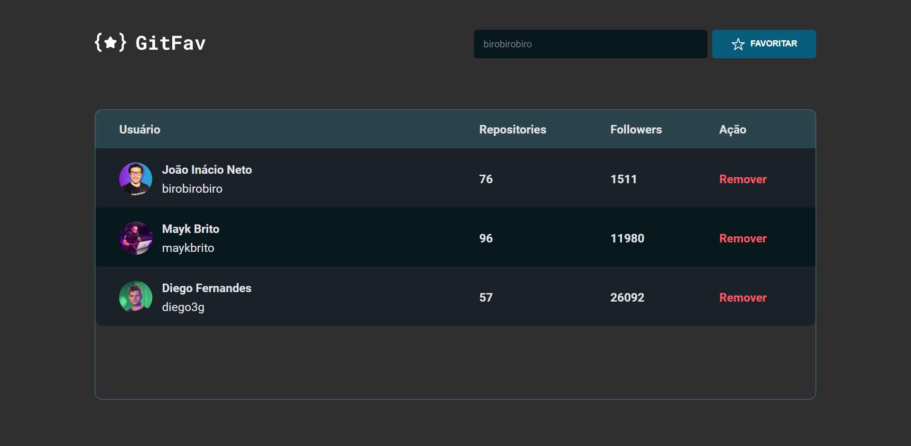

<h1 align="center">GIT FAV 🖖</h1>

Projeto SPA (Single Page Application) construido para exercitar conceitos sobre:

<ul>
  <li>SPA (Single page Application</li>
  <li>Assincronismo</li>
  <li>Class e Orientanção a objetos.</li>
  <li>Mapeamento de rotas</li>
</ul>

<h2 align="center">Tecnologias utilizadas</h2>

  

[<h2>🔗Abrir e Rodar o projeto🔗</h2>](https://git-fav-nu.vercel.app/)

